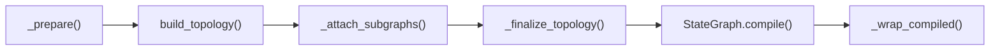

Compilation transforms a graph **factory class** into an invokable `CompiledGraph`. The sequence is fixed; each graph type overrides specific phases.

## Entry points

| Method | When to use |
| --- | --- |
| `compile_graph()` | Child subgraphs and intermediate compilation. Interrupts off by default. |
| `compile_as_root()` | Top-level orchestrator. Enables interrupts, accepts `state_defaults` for root invocation. |

```python
# Child: compile first, pass into parent
worker = WorkerAgent(
    state_schema=BaseState,
    context_schema=BaseContext,
).compile_graph()

orchestrator = OrchestratorAgent(
    state_schema=BaseState,
    context_schema=BaseContext,
    reports_to_supervisor=False,
)

root = orchestrator.compile_graph(compiled_subgraphs=[worker])
# or, for top-level runs:
root = orchestrator.compile_as_root(state_defaults=create_base_state_defaults())
```

`compile_as_root()` calls `compile_graph()` internally, then sets `compiled._root_state_defaults` so `after_entry_hook` can seed missing state channels on the first step.

## Six-phase pipeline



<Steps>
  <Step title="_prepare()">
    Load compilation kwargs. `ReactGraph` reads `compiled_subgraphs`, `compiled_subgraphs_front`, and `compiled_subgraphs_back` from kwargs and stores them on the instance.
  </Step>

  <Step title="build_topology()">
  Register core nodes and edges. **Must** be implemented by every graph type. `ReactGraph` adds `system`, `reasoning`, `tool` routing targets, error handlers, and `empty_back` / `final_back`.
  </Step>

  <Step title="_attach_subgraphs()">
    Wire child `CompiledGraph` instances into the parent topology. `ReactGraph` merges tool subagents, front stages, and back stages (see [Subagents](/concepts/subagents)).
  </Step>

  <Step title="_finalize_topology()">
    Late wiring after all nodes exist. `ReactGraph` sets the entry point, builds the `ToolNode`, registers conditional edges from `reasoning`, and connects the back chain to `final_back`.
  </Step>

  <Step title="StateGraph.compile()">
    LangGraph compiles the `StateGraph` into a `CompiledStateGraph`. Optional `checkpointer` is passed here.
  </Step>

  <Step title="_wrap_compiled()">
    Wrap the inner graph in `CompiledGraph` — hook pipeline, policy hooks, tool-answer protocol. See [CompiledGraph](/concepts/compiled-graph).
  </Step>
</Steps>

## ReactGraph phases in detail

### build_topology

Registers the ReAct loop skeleton before any children are attached:

- Nodes: `system`, `reasoning`, `empty_back`, `final_back`, validation handlers
- Edges: `system → reasoning`, error paths back to `reasoning`, `forced_exit → final_back → END`
- `conditional_states` map for `determine_action` routing

Subclasses call `super().build_topology()` then add nodes (as `TodoGraph` does for `todo_incomplete`).

### _attach_subgraphs

```python
def _attach_subgraphs(self) -> None:
    for subgraph in self.compiled_subgraphs:
        if subgraph.as_tool:
            self._merge_subgraph_as_tool(subgraph)
    self._merge_front_compiled_subgraphs()
    self._merge_back_compiled_subgraphs()
```

- **Tool subagents** (`as_tool=True`, default): added as a graph node *and* registered as an LLM-callable tool
- **Front stages**: chained before `system` (deterministic preprocessing)
- **Back stages**: chained after `empty_back` (deterministic postprocessing)

### _finalize_topology

- Sets entry point to `current_front` (may be a front-stage node)
- Collects all tools: builtins + `additional_tools` + `compiled_subgraphs_as_tools`
- Adds `ToolNode` with edge back to `reasoning`
- Adds conditional edges from `reasoning` via `determine_action`
- Connects `current_back → final_back`

## Convention: children before parent

Always compile child graphs **before** the parent and pass them via kwargs:

```python
class OrchestratorAgent(ReactGraph):
    name = "orchestrator"
    description = "Delegates to a worker"

    def compile_graph(self, *args, **kwargs):
        worker = WorkerAgent(
            state_schema=BaseState,
            context_schema=BaseContext,
            subagent_policy=ARTIFACT_POLICY,  # optional
        ).compile_graph()

        return super().compile_graph(
            *args,
            compiled_subgraphs=[worker],
            **kwargs,
        )
```

The parent's `_prepare` receives the list; `_attach_subgraphs` embeds each child. The child's `name` becomes the tool name the parent LLM calls.

## Factory hooks (compile-time vs run-time)

`BaseGraph` defines four **run-time** hooks you can override on your factory class:

| Hook | Called by | Purpose |
| --- | --- | --- |
| `entry_hook` | `CompiledGraph.entry_hook` | Custom logic when a subagent starts (after policy snapshot) |
| `exit_hook` | `CompiledGraph.exit_hook` | Custom logic when a subagent finishes (before parent restore) |
| `aentry_hook` | async entry path | Async variant |
| `aexit_hook` | async exit path | Async variant |

These are **not** part of the compile phases — they run inside the `CompiledGraph` hook pipeline on every invocation. Default implementations are pass-throughs.

## Checkpointer and interrupts

Pass `checkpointer=` to `compile_graph()` or `compile_as_root()`. Root compilation sets `enable_interrupts=True` by default for human-in-the-loop at the top level.

## Next

<Card title="CompiledGraph" icon="box" href="concepts/compiled-graph">
  Why the library wraps LangGraph's CompiledStateGraph and what the hook pipeline does.
</Card>
