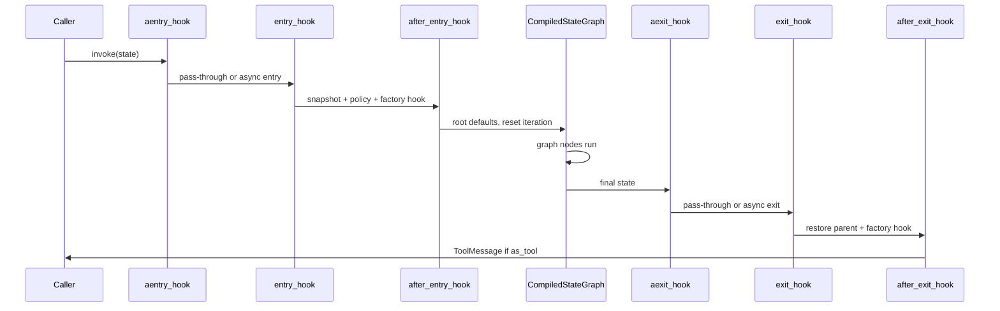

`compile_graph()` does not return LangGraph's `CompiledStateGraph` directly. It returns a **`CompiledGraph`** wrapper that owns the inner compiled graph and adds the behaviors required for production hierarchies.

## Why not CompiledStateGraph alone?

LangGraph's `CompiledStateGraph` is a runnable state machine. For decomposable agent hierarchies you also need:

1. A **hook pipeline** that survives embedding as a subgraph node
2. **State isolation** at subagent boundaries via `SubagentPolicy`
3. **Tool-answer emission** so subgraph results appear as `ToolMessage` responses
4. **Context propagation** so `runtime.context.model` flows through the tree
5. **Trace-safe embedding** so nested graphs remain visible in LangGraph traces

`CompiledGraph` implements all five.

## Hook pipeline

`_build_runnable()` assembles an explicit `Runnable` chain:

```python
# Execution order (outermost first):
# aentry -> entry -> after_entry -> compiled -> aexit -> exit -> after_exit
```



| Hook | Defined on | Role |
| --- | --- | --- |
| `aentry_hook` | `CompiledGraph` / factory `aentry_hook` | Async entry shim |
| `entry_hook` | `CompiledGraph` + factory `entry_hook` | Snapshot parent state, apply `SubagentPolicy` entry rules, call factory hook |
| `after_entry_hook` | `CompiledGraph` | Apply `_root_state_defaults`, reset `iteration_number` |
| *(inner graph)* | LangGraph | Actual agent execution |
| `aexit_hook` | `CompiledGraph` / factory `aexit_hook` | Async exit shim |
| `exit_hook` | `CompiledGraph` + factory `exit_hook` | Pop subagent stack, merge fields, call factory hook |
| `after_exit_hook` | `CompiledGraph` | Emit answering `ToolMessage` when invoked as a tool |

Building hooks as a `Runnable` sequence (rather than calling them manually) is critical: when `CompiledGraph` is registered as a graph node, LangGraph flattens the chain via `steps` and every hook — especially `after_exit_hook` — still executes.

## State isolation

When `subagent_policy` is set on the child factory, `entry_hook` and `exit_hook` manage the `__subagent_stack__`:

**Entry:** `_snapshot_parent_state` deep-copies the parent frame and pushes it onto the stack. `_apply_entry_policy` clears messages (and other fields per policy).

**Exit:** `_apply_exit_policy` pops the frame, restores the parent snapshot, copies `merge_fields` from the child, and drops `discard_fields`.

Factory-level `entry_hook` / `exit_hook` on your graph class run *inside* this envelope — use them for agent-specific setup, not for reimplementing isolation.

See [SubagentPolicy](/concepts/subagent-policy) for field-level control.

## Tool-answer emission

When a subgraph is invoked as a tool (`as_tool=True`) and `current_tool_call` is set, `after_exit_hook` synthesizes the response the parent LLM expects:

```python
tool_message = ToolMessage(
    content=state.get("current_agent_report", ""),
    name=tool_call["name"],
    tool_call_id=tool_call["id"],
)
state["messages"] = state.get("messages", []) + [tool_message]
```

Without this wrapper step, the parent `reasoning` node would see an unresolved tool call. The report content comes from `empty_back` or `forced_exit` inside the child `ReactGraph`.

## Context propagation

Top-level invocation passes dependencies via `context=`:

```python
result = root.invoke(
    create_base_state_defaults(),
    context=BaseContext(model=my_model),
)
```

`CompiledGraph._prepare_config` merges a LangGraph `Runtime(context=...)` into the config. Child subgraphs inherit the merged runtime, so `runtime.context.model` in `ReactGraph.reasoning` resolves without per-level wiring.

## Trace-safe embedding

Each `CompiledGraph` gets a unique `node_label` (name + random suffix) when embedded in a parent. The `steps` property exposes the inner hook pipeline so trace utilities can locate the embedded `Pregel` without flattening the wrapper into disconnected steps.

## node_label and as_tool

| Property | Purpose |
| --- | --- |
| `node_label` | Internal graph node name (unique per compile) |
| `name` | Public tool name the parent LLM calls |
| `as_tool` | When `True`, child is exposed as an LLM tool and emits `ToolMessage` on exit |
| `runnable` | Full hook pipeline — use for `invoke` / `stream` |
| `_compiled` | Raw `CompiledStateGraph` — used when Pregel-specific kwargs are needed |

## Invocation surfaces

`CompiledGraph` implements `invoke`, `ainvoke`, `stream`, `astream`, and state APIs (`get_state`, `update_state`, …). Most callers use `invoke` / `stream` on the root `CompiledGraph` returned by `compile_as_root()`.

## Next

<Card title="Subagents" icon="sitemap" href="/concepts/subagents">
  How subagents are attached, invoked, and return results to the parent.
</Card>
