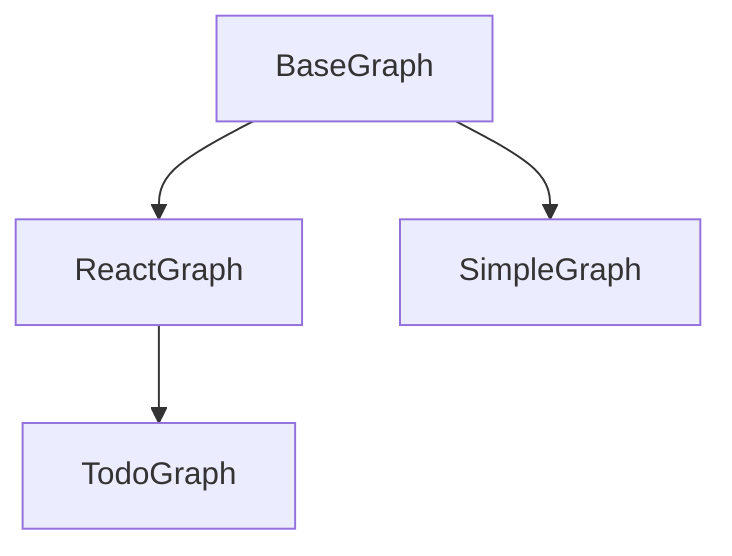

In **langgraph-hierarchies**, each agent is a **class-as-factory**: a Python class that subclasses `BaseGraph`, declares metadata as class attributes, and implements graph topology in `build_topology()`. Compilation turns the class into an invokable `CompiledGraph`.

## Pattern

```python
from langgraph_hierarchies.graphs.react import ReactGraph
from langgraph_hierarchies.state.context import BaseContext
from langgraph_hierarchies.state.schema import BaseState


class WorkerAgent(ReactGraph):
    name = "worker"
    description = "Completes a delegated task and reports upward"
    # build_topology() inherited from ReactGraph — override only to extend


class OrchestratorAgent(ReactGraph):
    name = "orchestrator"
    description = "Delegates work to worker subagents"
```

| Class attribute | Role |
| --- | --- |
| `name` | Graph ID, tool name when exposed as a subagent, trace label |
| `description` | Tool description shown to the parent LLM |
| `args_schema` | Pydantic model for subagent tool arguments (default: `ReactArgsSchema`) |

At construction time you pass `state_schema` and `context_schema` (LangGraph requirements). Optional kwargs include `subagent_policy`, `tools`, and `max_iterations`.

## Inheritance ladder



### BaseGraph

Abstract foundation. Subclasses **must** implement `build_topology()`. Provides:

- Phased `compile_graph()` / `compile_as_root()` — see [Compilation](/concepts/compilation)
- Overridable `entry_hook`, `exit_hook`, `aentry_hook`, `aexit_hook` for custom per-agent logic
- Optional `subagent_policy` attachment

Use directly only when you need a fully custom topology that does not fit `ReactGraph` or `SimpleGraph`.

### ReactGraph

Tool-calling ReAct loop with optional subgraph delegation. Default graph type for LLM-backed agents.

**Topology:** `system → reasoning ⇄ tool → … → empty_back → final_back → END`

**Key behaviors:**

- Binds `runtime.context.model` with supervisor or internal toolkits
- Routes tool calls to `ToolNode`, subagent nodes, or reporting paths
- Enforces iteration budgets (`max_iterations`, `task_iterations` from tool args)
- Attaches child graphs via `compiled_subgraphs`, `compiled_subgraphs_front`, `compiled_subgraphs_back`

**Override points:** `message_system`, `message_reasoning`, `system()`, `reasoning()`, `_handle_tool_call()`, `build_topology()` (to add nodes/edges)

### TodoGraph

Extends `ReactGraph` with a TODO gate: `report_to_supervisor` and `finish_task` are blocked until the TODO list is complete.

**Additional tools:** `todo_toolkit()` (create/update TODO items)

**Override points:** `todo_check` (custom completion predicate), `todo_check_fail_message`

Use for batch or checklist-driven agents where the supervisor must not receive a premature report.

### SimpleGraph

Single-node deterministic graph. No LLM, no tool loop.

**Topology:** `computation_node → END`

**Override points:** `computation_node(state, config) → dict`

Use for pure Python transformation stages in a pipeline (validation, formatting, file I/O) wired as `compiled_subgraphs_front` or `compiled_subgraphs_back`.

## include_in_progress and _UNSET

`BaseGraph` defines `include_in_progress: bool = True` and a sentinel `_UNSET = object()`.

The constructor accepts `include_in_progress=_UNSET` by default. Only when the caller passes an explicit value does the instance attribute change. This lets subclasses like `ReactGraph` forward `include_in_progress` to `BaseGraph` without accidentally overriding a parent default — `ReactGraph.__init__` uses the same `_UNSET` pattern so `None` and `False` are distinguishable from "not specified."

## Choosing a graph type

| Need | Graph type |
| --- | --- |
| LLM agent with tools and subagent delegation | `ReactGraph` |
| Same, but must complete a TODO list before reporting | `TodoGraph` |
| Deterministic preprocessing or postprocessing stage | `SimpleGraph` |
| Fully custom node/edge layout | `BaseGraph` subclass |

## Next

<Card title="Compilation" icon="gears" href="concepts/compilation">
  How `compile_graph()` assembles topology, attaches subagents, and wraps the result.
</Card>
