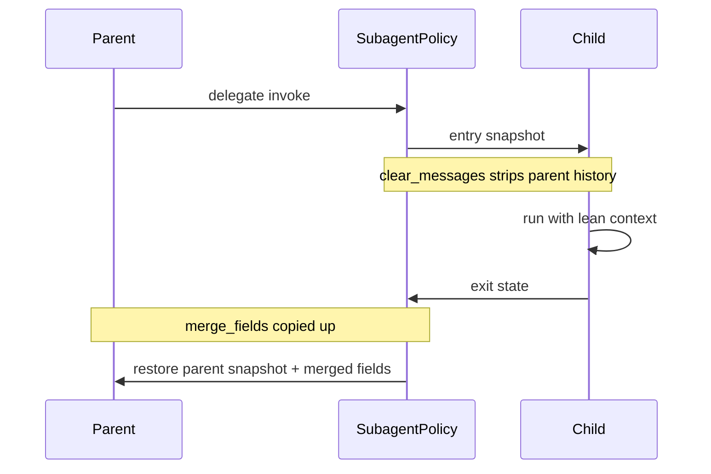

When a parent delegates to a child subgraph, you usually do **not** want the child to inherit the parent's full message history. You also need a controlled way to pass artifacts back up without leaking intermediate reasoning.

`SubagentPolicy` declares what happens at each subagent **entry** and **exit**:

```python
from langgraph_hierarchies.graphs.compiled import SubagentPolicy

ARTIFACT_POLICY = SubagentPolicy(
    clear_messages=True,
    merge_fields=["pipeline_artifact"],
)
```

Attach it when constructing a graph:

```python
class ExtractionOrchestrator(ReactGraph):
    name = "extraction_orchestrator"
    description = "Run OCR on validated documents"

    def __init__(self, **kwargs):
        super().__init__(
            subagent_policy=ARTIFACT_POLICY,
            **kwargs,
        )
```

## Fields

| Field | Default | Effect |
| --- | --- | --- |
| `clear_messages` | `True` | Strip inherited message history on subagent entry |
| `preserve_chat_with_operator` | `True` | Keep operator-facing chat messages when clearing |
| `reset_iteration` | `True` | Reset iteration counter for the child |
| `max_iterations` | `None` | Optional hard cap on child iterations |
| `merge_fields` | `[]` | State keys merged from child back to parent on exit |
| `discard_fields` | `[]` | State keys dropped on exit (never merged back) |

## Entry and exit flow



On **entry**, the policy snapshots relevant parent state, clears messages (and optionally other fields), and starts the child with lean context.

On **exit**, fields listed in `merge_fields` are copied from the child result into the parent's restored snapshot. Fields in `discard_fields` are dropped entirely.

## Artifact-only handoff

The IRS reporting example uses the same policy at every stage boundary:

```python
ARTIFACT_POLICY = SubagentPolicy(
    clear_messages=True,
    merge_fields=["pipeline_artifact"],
)
```

Each stage writes its output to `pipeline_artifact`. The next stage receives only that artifact — not the upstream message history or intermediate tool traces.

See [Example 02 — Artifact Handoff](https://github.com/korrino222/langgraph-hierarchies-examples) in the companion examples repository for a worked demonstration of this pattern.

## When to use which fields

<AccordionGroup>
  <Accordion title="clear_messages=True (default)">
    Use when the child should start with a clean conversation context. Typical for production hierarchies where parent reasoning should not bloat child checkpoints.
  </Accordion>

  <Accordion title="merge_fields for artifacts">
    Use when the child produces a structured result the parent needs — reports, extracted data, file references. Prefer explicit artifact fields over passing full message history.
  </Accordion>

  <Accordion title="discard_fields for scratch state">
    Use for temporary working state the parent should never see — intermediate tool outputs, draft reasoning, per-item scratch keys.
  </Accordion>

  <Accordion title="max_iterations">
    Use as a safety net on deep or expensive subgraphs. Pair with `ReactGraph` iteration budgets for supervisor-controlled limits.
  </Accordion>
</AccordionGroup>
