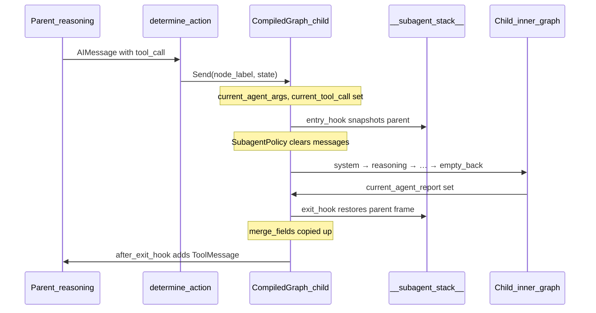

Subagents are compiled child graphs embedded in a parent. The parent delegates work by calling the child as an LLM tool (default) or by routing through deterministic front/back pipeline stages.

## Three attachment modes

`ReactGraph.compile_graph()` accepts three lists of `CompiledGraph` instances:

| Kwarg | Default role | LLM-visible? |
| --- | --- | --- |
| `compiled_subgraphs` | Delegatable subagents (`as_tool=True`) | Yes — registered as tools |
| `compiled_subgraphs_front` | Preprocessing before `system` | No — deterministic pipeline |
| `compiled_subgraphs_back` | Postprocessing after `empty_back` | No — deterministic pipeline |

### as_tool (primary mode)

When `subgraph.as_tool` is `True` (default):

1. Child is added as a graph node (`subgraph.node_label`)
2. Edge: `subgraph.node_label → reasoning` (returns control to parent loop)
3. Child is converted to a tool via `convert_runnable_to_tool` and bound to the parent model

The parent LLM calls the child by `name` with arguments matching the child's `args_schema` (for `ReactGraph`: `task`, `task_scope`, `task_iterations`).

### Front stages

Front subgraphs chain **before** `system`:

```
front_stage_N → … → front_stage_1 → system → reasoning → …
```

Use `SimpleGraph` or custom `BaseGraph` subclasses for validation, normalization, or context loading. Reversed iteration in `_merge_front_compiled_subgraphs` preserves declaration order.

### Back stages

Back subgraphs chain **after** `empty_back`:

```
… → empty_back → back_stage_1 → … → back_stage_N → final_back → END
```

Use for aggregation, artifact packaging, or cleanup before the parent exits.

## Invocation sequence

When the parent LLM calls a subagent tool:



Key steps:

1. **`determine_action`** matches the tool name to a `compiled_subgraphs` entry and returns `Send(subgraph.node_label, state)`.
2. **`entry_hook`** pushes a deep-copied parent frame onto `__subagent_stack__`, then applies `SubagentPolicy` entry rules.
3. **Child runs** its own ReAct loop with lean context (typically empty `messages`).
4. **`exit_hook`** pops the stack frame, restores parent state, merges allow-listed fields.
5. **`after_exit_hook`** appends a `ToolMessage` so the parent can continue reasoning.

<Warning>
  Do not spread full parent state into `Send` payloads if it includes LangGraph managed channels like `remaining_steps`. The library strips these automatically in `ReactGraph`.
</Warning>

## Return sequence

The child's report path:

1. LLM calls `report_to_supervisor` or `finish_task`
2. `empty_back` writes `current_agent_report` (and optionally `is_finished`)
3. Graph routes through `final_back` (no-op — avoids echoing managed state)
4. `exit_hook` merges `current_agent_report` into the restored parent frame
5. `after_exit_hook` wraps the report as a `ToolMessage` tied to `current_tool_call`

The parent `reasoning` node then sees the tool response in `messages` and can continue or report upward itself.

## Subagent stack vs call stack

`__subagent_stack__` behaves like a **call stack of state frames**:

| Call stack | Subagent stack |
| --- | --- |
| Push frame on call | `_snapshot_parent_state` deep-copies parent state |
| Pop frame on return | `_apply_exit_policy` pops and restores |
| Local variables | Child's `messages`, `iteration_number`, etc. |
| Return value | `current_agent_report` + `merge_fields` |

**Important differences:**

- The child does **not** inherit the parent's `messages` when `clear_messages=True` (default). This is intentional context isolation, not a bug.
- Only fields in `merge_fields` (plus `progress` and `current_agent_report` always) flow back to the parent. Everything else the child wrote stays discarded.
- Each graph level has its own `remaining_steps` counter. Recursion limits are independent per compiled subgraph.

Nested delegation (parent → child → grandchild) pushes multiple frames. Each exit pops one level.

```python
# Stack frame shape (internal)
{
    "agent_name": "worker",
    "saved_state": { ... deep-copied parent channels ... },
}
```

## Controlling isolation

Attach `SubagentPolicy` on the **child** factory class:

```python
from langgraph_hierarchies.graphs.compiled import SubagentPolicy

ARTIFACT_POLICY = SubagentPolicy(
    clear_messages=True,
    merge_fields=["pipeline_artifact"],
)

worker = WorkerAgent(
    state_schema=BaseState,
    context_schema=BaseContext,
    subagent_policy=ARTIFACT_POLICY,
).compile_graph()
```

See [SubagentPolicy](/concepts/subagent-policy) for the full field reference and artifact-handoff pattern.

## Parallel tool calls

`ReactGraph` blocks parallel tool calls that include a subagent dispatch. Subagents must be invoked alone in a separate reasoning step. Ordinary tools may still run in parallel when no subagent is in the batch.

## Next

<Card title="SubagentPolicy" icon="layers" href="concepts/subagent-policy">
  Declarative clear, merge, and discard rules at every hierarchy boundary.
</Card>
